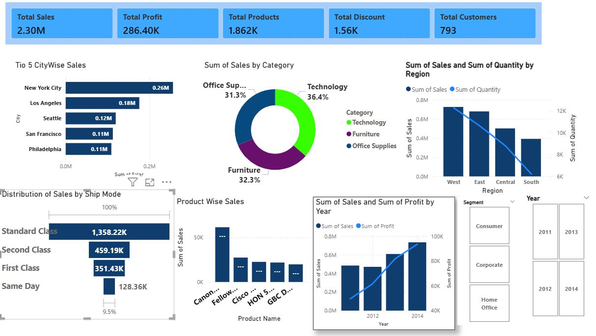

# E-Commerce Sales & Profit Performance Dashboard

## 📊 Project Overview

An interactive data analytics portfolio tracking **\$2.30M in Total Sales** and **\$286.40K in Net Profit**. This project focuses on frontline visual reporting, data modeling, and business intelligence development inside Microsoft Power BI. It evaluates profitability metrics, product margins, and transactional loops to uncover hidden corporate revenue leakage and performance milestones.

---

## 💡 Key Business Insights Delivered
* **Executive Performance Tracking:** Consolidated \$2.30M Gross Sales across 793 active customers with a total volume of 1.56K unique product orders.
* **Regional Optimization:** Highlighted East and West regions as top growth channels, with New York City (\$0.26M) and Los Angeles (\$0.18M) leading the top 5 city-wise transactions.
* **Segment Profitability:** Identified Technology as the highest-grossing category (36.4% distribution), followed closely by Furniture (32.3%) and Office Supplies (31.3%).
* **Logistics & Shipments:** Calculated that Standard Class shipping routes drove the highest logistical load, accounting for \$1,358.22K in overall transaction value.

---

## 🛠️ Data Infrastructure & Tech Stack
* **BI Dashboard Platform:** Microsoft Power BI Desktop (`.pbix`)
* **Data Modeling Structure:** Star Schema layout optimization
* **Analytical Expressions:** DAX (Data Analysis Expressions) for calculated measures, KPI values, and conditional visuals

---

## 💻 Power BI Architecture & DAX Implementation Examples

The interactive metrics displayed on this dashboard are driven by custom Data Analysis Expressions (DAX) and dynamic context sorting. Below are examples of how the core business logic was constructed within the report:

### 1. Total Calculated Sales (Key Performance Indicator Card)
Aggregates the transaction lines across all product distributions to establish our \$2.30M baseline revenue anchor:
* **Calculation Pattern:** `Total Sales = SUM(Sales[Amount])`

### 2. Profit Margin Tracking (Operational Efficiency Metrics)
Evaluates net financial returns against revenue scales to monitor which products drive real net growth vs baseline volume:
* **Calculation Pattern:** `Total Profit = SUM(Sales[Profit])`

### 3. Core Slicers & Context Filters
The model leverages a centralized filtering architecture allowing users to seamlessly drill down into performance metrics dynamically across:
* **Time Dimensions:** Slicers filtered across historical milestone loops (`2011`, `2012`, `2013`, `2014`).
* **Market Vectors:** Segment filters exploring `Consumer`, `Corporate`, and `Home Office` demand branches.

---

## 📁 Repository Structure
```text
├── E-Commerce Sales Analysis.pbix  # Full interactive Power BI Desktop report file
└── README.md                       # Project documentation and summary portfolio (This file)
```

## 🚀 How to Open and Review the Dashboard
1. Download the `.pbix` file from this repository list above.
2. Ensure you have the latest free desktop version of [Power BI Desktop](https://microsoft.com) installed.
3. Open the file to filter, toggle, and interact with the live visualizations across active Year, Region, and Segment slicers.
